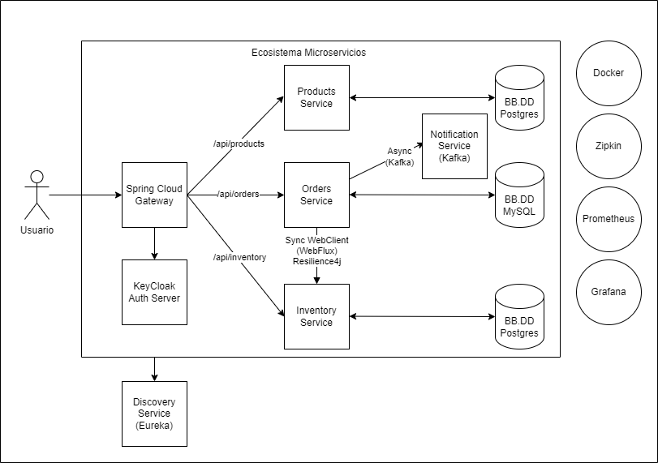
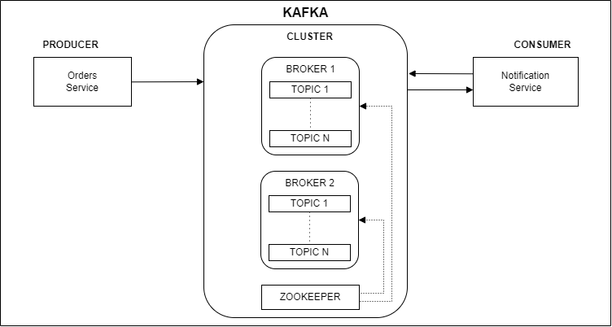

# springboot-microservicios-shop-app
Ejemplo de aplicación de una tienda con una arquitectura de microservicios empleando spring-boot y spring-cloud.

Diagrama de la aplicación:

### api-gateway
Microservicio de API Gateway (Spring Cloud API Gateway, Load Balanced).

Endpoints de inventory-service:
* GET http://localhost:8080/api/inventory/{sku}
* POST http://localhost:8080/api/inventory/in-stock
    * [
          {
              "id": 1,
              "sku": "00001",
              "price": 4321,
              "quantity": 2
          }
      ]
 
Endpoints de orders-service:
* GET http://localhost:8080/api/order
* POST http://localhost:8080/api/order
    * {
          "orderItems": [
              {
                  "sku": "00002",
                  "price": 234,
                  "quantity": 1
              }
          ]
      }

Endpoints de products-service:
* GET http://localhost:8080/api/product
* POST http://localhost:8080/api/product
    * {
          "sku": "000001",
          "name": "PC gamer 1",
          "description": "Best PC 1",
          "price": 5430,
          "status": true
      }

### discovery-server
Microservicio de registro y búsqueda de microservicios (Spring Cloud Eureka Server) donde registramos los microservicios de api-gateway, inventory-service, orders-service, products-service y notification-service.

Url de la consola de administración: http://localhost:8761

### inventory-service
Microservicio de inventario (inventory).

Endpoints:
* GET http://localhost:8083/api/inventory/{sku}
* POST http://localhost:8083/api/inventory/in-stock
  * [
        {
            "id": 1,
            "sku": "00001",
            "price": 4321,
            "quantity": 2
        }
    ]

### orders-service
Microservicio de pedidos (orders).

Endpoints:
* GET http://localhost:8082/api/order
* POST http://localhost:8082/api/order
    * {
        "orderItems": [
            {
                "sku": "00002",
                "price": 234,
                "quantity": 1
            }
        ]
      }

### products-service
Microservicio de productos (products).

Endpoints:
* GET http://localhost:8081/api/product
* POST http://localhost:8081/api/product
    * {
        "sku": "000001",
        "name": "PC gamer 1",
        "description": "Best PC 1",
        "price": 5430,
        "status": true
      }

### Auth Server KeyCloak
Url de la consola de administración de keycloak http://localhost:8181

Usuarios/Roles creados:
- Usuario: admin_user, Contraseña: Test123, Rol: ADMIN
- Usuario: basic_user, Contraseña: Test123, Rol: USER

Datos para obtener un token a través de Oauth2 (previanmente se debe acceder a un endpoint desde un navegador para una vez autenticado con un usuario al acceder al endpoint se generen las cookies necesarias para para llamar al endpoint que genera el token el cual se emplea para hacer las llamas a los endpoints).
- authorization_endpoint: http://localhost:8181/realms/shop-app-realm/protocol/openid-connect/auth
  - response_type: code
  - client_id: shop-app_client
  - client_secret: <CLIENT_SECRET>
  - scope: openid
  - redirect_uri: http://localhost:8080/login/oauth2/code/keycloak

- token_endpoint: http://localhost:8181/realms/shop-app-realm/protocol/openid-connect/token
  - code: <CODE_DEVUELTO_URL_AUTH>
  - client_id: shop-app_client
  - client_secret: <CLIENT_SECRET>
  - grant_type: password
  - username: admin_user o basic_user
  - password: Test123

### Actuator - Resilience4j - Cirtuit Breaker
Añadimos actuator a los tres microservicios (inventario, ordenes y productos) para tener métricas de salud de los microservicios y ver el funcionamiento del circuit breaker en el microservicio de ordenes en su llamadas al microservicio de inventario.

Empleando la librería resilience4j añadimos el cirtuit break en el microservicio de ordenes para las llamadas al microservicio de inventario que se hace dentro de ordenes.

### notification-service (kafka)
Microservicio de notificaciones (notification). 

Microservicio consumidor que consume los mensajes enviados al topic "orders-topic" por parte del microservicio productor Order Service para notificar la realización de un pedido. 

Diagrama Kafka de la aplicación:

### Rastreo y Monitoreo (Zipkin, Prometheus, Grafana)
#### Zipkin
Herramienta de tracing distribuido diseñada para ayudar a los desarrolladores a rastrear y solucionar problemas en sistemas de microservicios y arquitectura distribuidas.

La principal función es proporcionar visibilidad sobre cómo las solicitudes se propagan a través de diferentes servicios en un aplicación distribuida.

Url: http://localhost:9411

#### Prometheus
Sistema de monitoreo y alerta de código abierto que se utiliza para recolpilar, almacenar, consultar y visualizar métricas y datos de rendimiento de sistemas y aplicaciones.

Se encarga de recopilar métricas de sistemas y aplicaciones a intervalos regulares, estas métricas son almacenadas en una base de datos de series temporales.

Url: http://localhost:9090

#### Grafana
Plataforma utilizada para la visualización y el análisis de datos.

Se utiliza para crear paneles interactivos y gráficos que representan datos de métricas y registros, lo que permite a los usuarios monitorear y analizar el rendimiento y la salud de sistemas, aplicaciones y servicios.

Podemos conectarnos a una variedad de fuente de datos incluyendo base de datos relacionales, base de datos de series temporales (prometheus), servicios en la nube, etc, esto permite integrar datos de diversas fuentes en un único panel.

Url: http://localhost:3000

Al crear una fuente de datos (data sources) de Prometheus establecemos como "Prometheus server URL" el valor "http://host.docker.internal:9090".

Los dashboards a añadir los añadimos del catálogo de la página de grafana.
